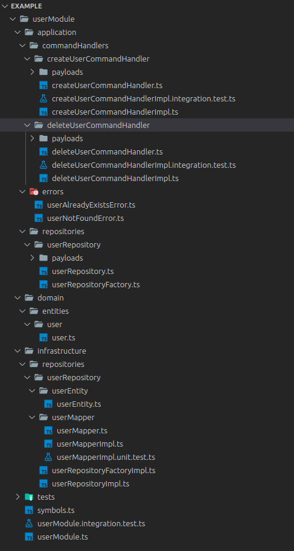
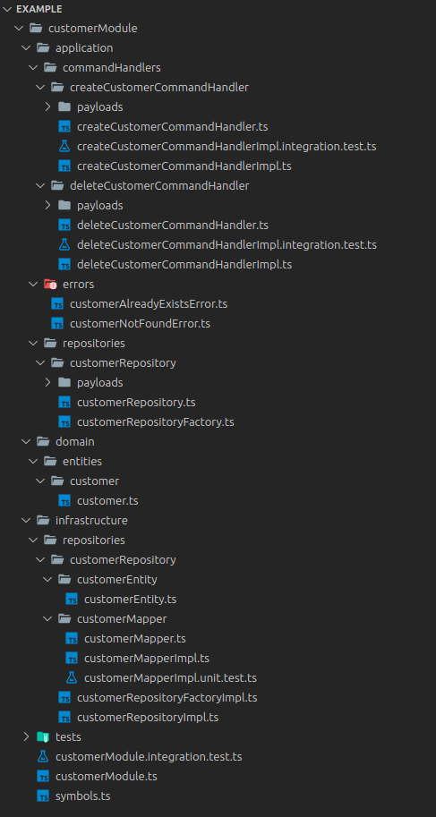

# Smart rename

A simple utility for bulk renaming using search and replace.

## Installation

```
npm i -g smart-rename
```

## Example with directory

```
smart-rename . --from user --to customer
smart-rename . --from User --to Customer
```

<p float="left">
  
   
</p>

## Example with git

```
smart-rename git --from user --to customer
```

## Flags

```
smart-rename <source>

Replace all occurences in paths names.

Positionals:
  source  Directory path or 'git' (staged files) to replace all occurrences

Options:
      --version  Show version number
  -f, --from     Rename from
  -t, --to       Rename to
  -e, --exclude  Directories/files names to be excluded from search
      --help     Show help
```
